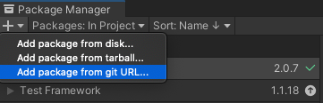
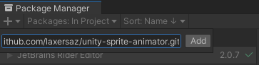
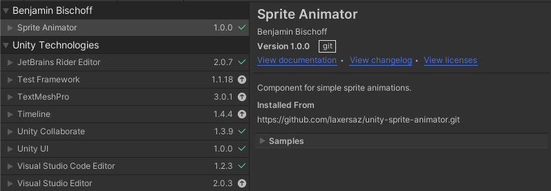
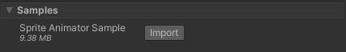
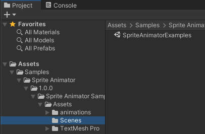
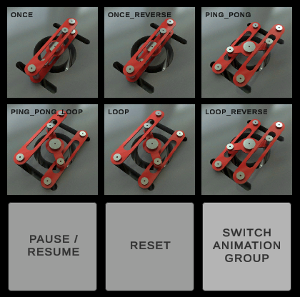

[](https://www.linkedin.com/in/benjamin-bischoff/)

# Sprite Animator for Unity
## Animate Sprites for lively game UIs in Unity 3D Projects


An easy way to animate sprites within image components - especially for use in UIs. It supports various animation methods as well as triggers that can be used to react to specific frames in the animation.

Please check the [Changelog](CHANGELOG.md) for changes.

# Installation

## Installing the package

The easiest way to install Sprite Animator is through Unity's Package Manager.

1. Choose "Add package from git URL..."

   

2. Enter `https://github.com/bischoffdev/unity-sprite-animator.git` and click "Add"

   

3. After installation, you should see this:

   

## Installing the sample

If you want to see a working example that uses the Sprite Animator, you can also add the sample that comes bundled in the package.

1. From the Unity Package Manager, select the Sprite Animator package, click on the arrow next to "Samples" and click on "Import"

   

2. After the import, you can find the "SpriteAnimatorExamples" scene in

   ```
   Assets
   |-- Samples
       |-- Sprite Animator
           |-- x.x.x (the version number)
               |-- Sprite Animator Sample
                   |-- Assets
                       |-- Scenes
   ```

   

3. Open the scene and press play to see a working example that showcases the different animation modes and features.

   

## Usage

Tbd.
